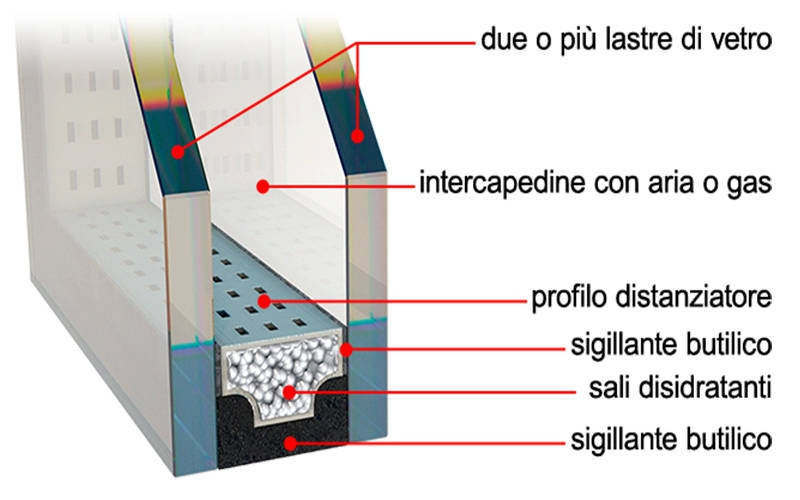
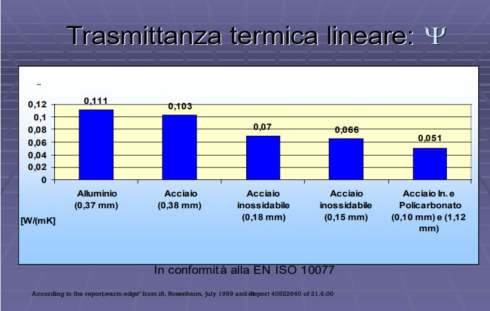
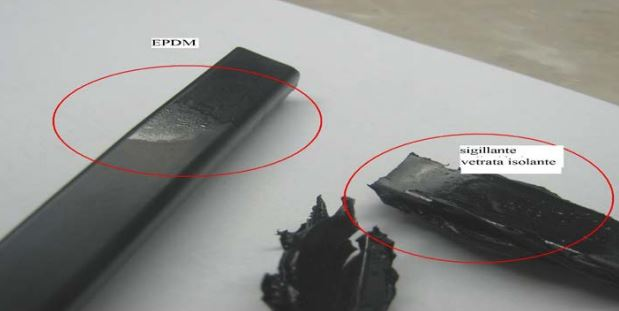
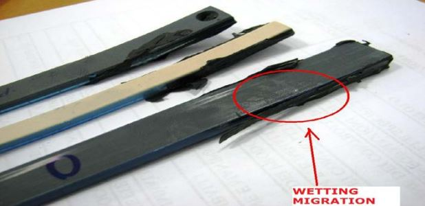
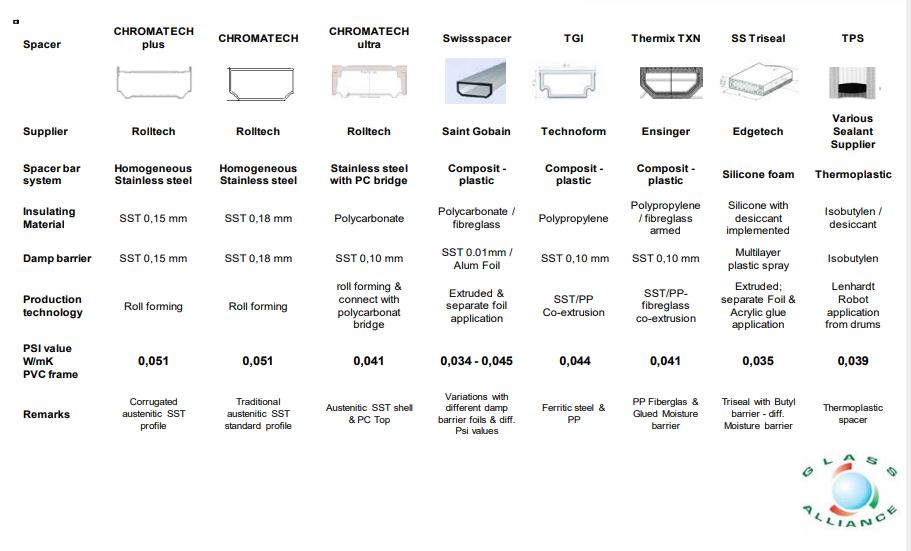

# Definizioni e descrizioni

# Table of contents

- 1 [Definizione generale](#1)
- 2 [Materiali del telaio](#2)
- 3 [Sistemi di apertura](#3)
- 4 [Distanziatori](#4)

[Back to contents](#0)  
## Definizione generale
Si definisce **infisso** il telaio su cui sono fissate le  parti apribili, dette **ante** o **partite**, di finestre,porte, ecc., oppure i vetri o pannelli di un serramento non apribile.

Tra le **Funzioni** principali si può elencare:
 - Passaggio di luce dall'esterno e consentire di guardare all'esterno tramite una lastra di tamponamento trasparente.
 - Aerazione dei locali nel caso di serramenti apribili.
 - Permmettere l'affaccio verso l'esterno (Se apribili)
 - Accesso da o verso l'esterno, nel caso di porte finestre.
 - Esposizione di prodotti al pubblico tramite vetrate fisse.
 - Protezione dell'abitazione da intrusioni.

[Back to contents](#0)  
## Materiali del telaio
 - **Legno**: utilizzato in larga scala, offre come vantaggio quello di essere ecologico e reperibile (in base al sito di produzione). E' in grado di offrire un buon grado di isolamento termico dato dalle proprietà insite nel materiale. Inoltre presenta una relativa facilità nella riparazione. Come svantaggio si può identificare una tendenza alla deformazione e deperimento sotto l'azione di agenti atmosferici durante il periodo di utilizzo. In genere i metodi di riparazione o trattamento richiedono l'utilizzo di solventi o componenti chimici che vanno ad intaccare il vantaggio di essere "ecologico".
 Sezioni tipiche dell'elemento sono di tipo "pieno".

 - **Acciaio**: identificato nel linguaggio comune come "ferro finestra" sono quei serramenti in genere composti da lega ferro carbonio di qualità S 235 JR. Offre caratteristiche meccaniche e resistenza alla deformazione maggiori a discapito della propria conducibilità termica che risulta essere maggiore. Inoltre se non adeguatamente trattato può essere soggetto a corrosione. In genere il peso proprio del telaio tende ad essere maggiore rispetto ad uno composto da pvc o alluminio.

 - **Alluminio**: presenta un ottima durabilità anche a basse frequenze di manutenzione. La produzione è di facile realizzazione (ad esempio tramite estrusione). Il peso proprio del serrmaneto rimane contenuto e i suo prezzi risultano essere competitivi rispetto ad una controparte in legno. Non è in grado di fornire un aspetto "gradevole" per l'edilizia abitativa, non offre un buon isolamento termico e può presentare condense superificiali. Dalla seconda metà del XX secolo viene implementata la tecnologia a "taglio termico" che prevede la separazione della parte esterna da quella interna del profilato per mezzo di un elemento plastico. Grazie a questa miglioria il telaio può raggiungere prestazioni termiche più elevate, eliminando il fenonmeno della condensa sulla superficie interna per mezzo dell'equalizzazione delle pressioni. In genere vengono scelti per edifici commerciali o uffici.

 - **PVC**: Polivinilcloruro, è un materiale polimerico termoplastico. Presenta buone prestazioni isolanti mantenendo un peso e prezzo molto contenuto. La durabilità di questo materiale è dipendende dal colore e, in quanto materiale organico, risulta essere molto sensibile alla radiazione solare. E' importante valutare la variazione cromatica durante il suo ciclo di vita.

 - **Misti**: diffusi verso la fine del XX secolo sono quei telai composti da due materiali uno "caldo" e uno "freddo" quali:
   - legno/Alluminio
   - legno/bronzo
   - legno/PVC/Alluminio
   - ecc.

 combinano la resistenza della sezione in metallo posta a contatto con l'esterno e al basso valore di trasmittanza termica del materiale "caldo". Sono più adatti all'utilizzo abitativo in quanto più gradevoli architettonicamente. Il più diffuso è quello legno/allumminio che combina una facilità di lavorazione e leggerezza.

[Back to contents](#0)
## Sistemi di apertura

- **battente**: l'infisso è in grado di ruotare per mezzo di cerniere verticali. Permettono l'affaccio o, nel caso di portefinestre, l'uscita dell'utente dal locale.
- **Vasistas**: detto anche a "ribalta" permettono un controllo della ventilazione limitando il flusso di aria esterna. Spesso possono essere combinati con un apertura a battente.
- **Bilico**: gira su un perno posto centralmente al telaio aprendosi sul suo asse verticale ed orizzontale.
- **Saliscendi** consiste in due ante che scorrono verticalmente. Essendo collegate con una corda si aprono insieme, dove quella superiore scorre verso il basso e quella inferiore verso l'alto.
- **Scorrevole**: poggiano su carelli muniti di ruote e permettono lo scorrimento della finstra.

Quando progettate è importante prestare attenzione alle sollecitazioni meccaniche agenti sul telai o cerniere durante il loro utilizzo.

[Back to contents](#0)
## Distanziatori

Per la realizzazione dei vetri camera è necessario l'utilizzo di distanziatori posti tra le lastre. Tale componente è inserito lungo tutto il perimetro interno del serramento.

La funzione principale è quella di creare uno spessore per una camera interna in cui vi è inserito un gas inerte quale:
- aria secca
- Krypton
- Argon
- Xenon

che ha scopo di aumentare la resistenza termica del serramento. Il gas scelto fornisce gradi di prestazione diversi grazie alla diversa massa atomica dello stesso. Il distanziatore, fissato ai vetri con apposito sigillante butilico, garantisce la tenuta del gas e impedisce l'ingresso di umidità all'interno della cavità.

Si identificano due principali categorie di distanziatori:

- Bordo freddo: prodotti in alluminio. Ormai meno utilizzati, presentano una maggiore conducibilità termica e producono ponti termici significativi per i serramenti ad alte prestazioni moderni.

- Bordo caldo: prodotti in materiali con conducibiltà termica sensibilmente minore rispetto alla controparte "fredda". Tali materiali possono essere: Schiume flessibili, termoplastici,combinati plastica/metallo, acciaio inossidabile. Analizzati in seguito.

1. *Distaziatori flessibili*: a base termoplastica e/o siliconica duttili, flessibili e con setacci molecolari incorporati. Si dividono in *butilici* (es. TPS) o *siliconici* applicati a freddo che vengono butilati lateralmente e con il dorso a contatto con il sigillante esterno (es. SS Triseal)
2. *Distanziatori Combinati plastica/metallo*: materiali plastici (policarbonati,polipropilene,ecc.) accoppiati con bassi spessori metallici con lavorazione simile a quelli in alluminio. Ovvero con piegatura,butilatura e foratura per l'inserimento di sali e gas. (es. Chromatech Ultra,Swisspacer, Thermix TXN, TGI)
3. Distaziatori in acciaio inossidabile

*Benefici della scelta dei distanziatori a bordo caldo*:

- Risparmio energetico
- Diminuzione del fenomeno di condensa esterna al vetro isolante
- Diminuzione dei rischi di formazione muffe

*Criticità distanziatori a bordo caldo*:
- Stabilità meccanica e dilatazione termicamente
- Compatibilità con i sigillanti di bordo
- Adesione al sigillante esterno (EN 1279/6)
- Difficoltà di utilizzo in produzione e maggiori controlli (EN 1279/1: System Description)
- Conformità alle norme, in particolare EN 1279
- Permeabilità all'umidità e perdita di gas
- Presenza di untuosità, ingiallimenti e discioglimenti.

Normativa guida sulle prestazioni e requisiti del distanziatore è la EN 1279 di cui si evidenzia la parte 2 sulla penetrazione dell'umidità e la parte 3 sulla velocità di perdita del gas,

Qui di seguito si riportano alcuni prodotti in commercio:

